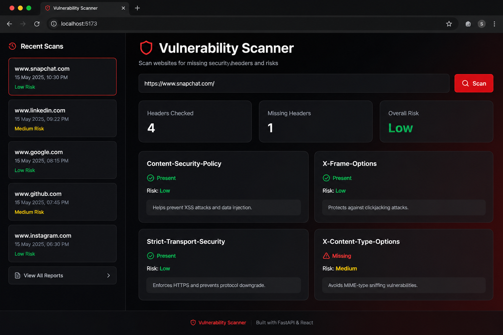
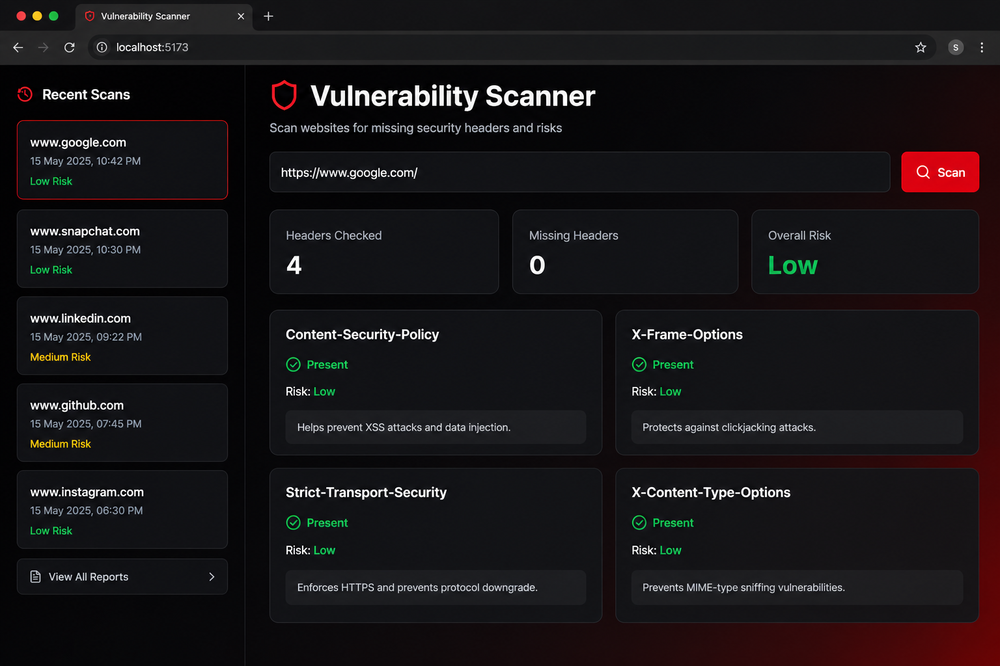

# 🔍 Vulnerability Scanner

A full-stack cybersecurity dashboard that scans websites for missing security headers and analyzes security risks.

Built using:
- FastAPI
- React
- TailwindCSS
- Axios

---

## 🚀 Features

- Security header scanning
- Risk classification
- Recommendations for missing headers
- Overall risk assessment
- Scan history dashboard
- Report storage
- Logging system
- Interactive React frontend
- Modern cybersecurity UI

---

## 🛠 Tech Stack

### Backend
- FastAPI
- Python
- Requests

### Frontend
- React
- TailwindCSS
- Axios
- Lucide React Icons

---

## 📂 Project Structure

```bash
vuln-scanner/
│
├── backend/
│   ├── app/
│   ├── logs/
│   ├── reports/
│   └── requirements.txt
│
├── frontend/
│   ├── src/
│   └── package.json
│
└── README.md
```

---

## ⚡ Installation

### Clone Repository

```bash
git clone <your-repo-url>
cd vuln-scanner
```

---

## 🔧 Backend Setup

```bash
cd backend

pip install -r requirements.txt

uvicorn app.main:app --reload
```

Backend runs on:

```bash
http://127.0.0.1:8000
```

---

## 💻 Frontend Setup

```bash
cd frontend

npm install

npm run dev
```

Frontend runs on:

```bash
http://localhost:5173
```

---

## 📡 API Endpoints

### Scan Website

```http
POST /scan
```

Example Request:

```json
{
  "url": "https://example.com"
}
```

---

### Get Scan Reports

```http
GET /reports
```

---

## 📸 Screenshots




---

## 🔮 Future Improvements

- PDF report export
- Authentication system
- Docker deployment
- Advanced vulnerability checks
- CVE integration
- Real-time scanning

---

## 👨‍💻 Author

Built by Sumit Sah
